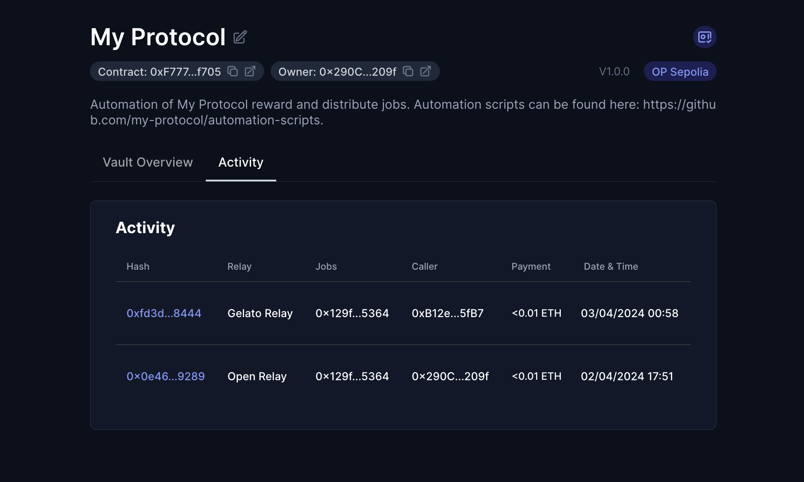

# Enable the Keep3rRelay on your Vault

> 🚧 Prerequisite: Please ensure you have completed the [Automation Vault setup](./automation_vault.md) before proceeding. In this case, the selected network will be Ethereum Sepolia.

The Keep3r Relay allows you to connect the Keep3r Network to an array of automation networks within xKeeper, offering a current incentive of 120% of the gas costs. For comprehensive details regarding Keep3r Network, refer to their [documentation](https://docs.keep3r.network/).

## Step 1: Add the relay in your vault

Inside your vault, find and click "Add New Relay," then choose Keep3r Relay from the list.

In the Callers section of the window that appears, activate the "Allow any caller" option to permit any address to execute your job. Remember that only valid keep3r users who have successfully registered will be able to run Automation Vault.

Next, in the Jobs section, input the details of your job. For this guide, we will use a sample job we've made available on all testnets:

> Job Address: `0x129f5C4Adf38a1860e54DE46970653465A605364`
>
> Work function: `work (0x322e9f04)`

Also, you will need to approve both **isKeeper** to validate the caller and **worked** to execute the payment. This requires the address of Keep3rV2.

> Job Address: `0xf171B63F97018ADff9Bb15F065c6B6CDA378d320 (Keep3rV2)`
>
> isKeeper function: `isKeeper (0x6ba42aaa)`
>
> worked function: `worked (0x5feeb794)`

Now proceed by confirming in order to submit the transaction.

<video controls width="1280">
  <source src="../../media/how-to/keep3r_relay/setup.mp4" type="video/mp4">
  <source src="../../media/how-to/keep3r_relay/setup.webm" type="video/webm">
  Your browser does not support the video tag.
</video>

## Step 2: Register your Automation Vault as a Keep3r Job

Open your web browser and navigate to [Keep3r Network](https://keep3r.network/). Connect your wallet and click on "Register Job". The address to register is your Automation Vault.

<video controls width="1280">
  <source src="../../media/how-to/keep3r_relay/register.mp4" type="video/mp4">
  <source src="../../media/how-to/keep3r_relay/register.webm" type="video/webm">
  Your browser does not support the video tag.
</video>

## Step 3: Wrap Some ETH and mint KP3R

To participate in the Keep3r network, wrap some of your ETH into WETH (Wrapped ETH). This is done through the WETH contract, available on most chains.

Mint KP3R tokens. Since we are on a test network, anyone can mint KP3R tokens for themselves. These will be necessary later to mint kLPs, which will generate Keep3r credits for you.

<video controls width="1280">
  <source src="../../media/how-to/keep3r_relay/mint.mp4" type="video/mp4">
  <source src="../../media/how-to/keep3r_relay/mint.webm" type="video/webm">
  Your browser does not support the video tag.
</video>

## Step 4: Mint and add kLPs to your Keep3r Job

Mint and add your kLP tokens to your registered Keep3r job. This action enables your job to start earning rewards and participate in the network's automation processes. To do this, it will be necessary to have followed the previous steps and have a balance of both WETH and KP3R.

<video controls width="1280">
  <source src="../../media/how-to/keep3r_relay/mintAndAdd.mp4" type="video/mp4">
  <source src="../../media/how-to/keep3r_relay/mintAndAdd.webm" type="video/webm">
  Your browser does not support the video tag.
</video>

After adding kLP liquidity, this process can take some time until the credits have been generated. Generally, in less than one day, you will have sufficient credits to continue with the process.

## Step 5: Turn Into a Keeper

Convert your status to a keeper. In the Keep3r network, anyone can become a keeper; it is not necessary to bond any assets upfront. Initially, you will need to execute the bond function with the Keep3r address, and importantly, the amount can be zero. Following this, you will call the activate method to complete the process and officially become an active keeper. This sequence ensures that you are recognized within the network without the requirement to lock in any initial funds.

## Step 6: Work Your Job for the First Time

Initiate your first task as a keeper. This step involves a layered interaction where you, as the keeper, will call the Keep3r Relay. The Keep3r Relay, in turn, interacts with the Automation Vault, which acts as the registered job. The system will verify that you are a valid keeper. Once the work has been successfully completed, the payment to you, the keeper, will be facilitated through the worked method. This ensures that the process not only verifies keeper authenticity but also secures a smooth transaction of rewards upon job completion.

## Step 7: Verify execution

After the first work transaction is included onchain, you will be able to find its details under the Activity tab if your vault.

