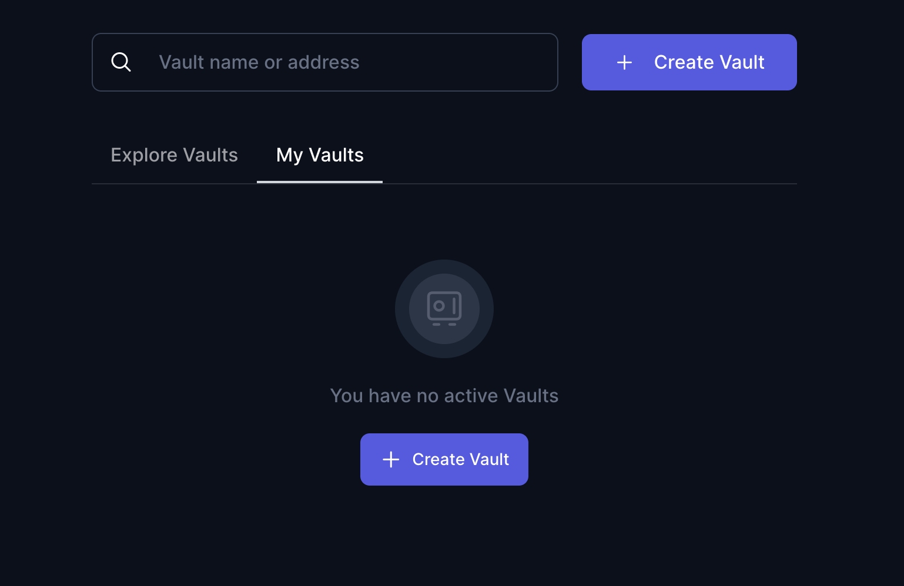
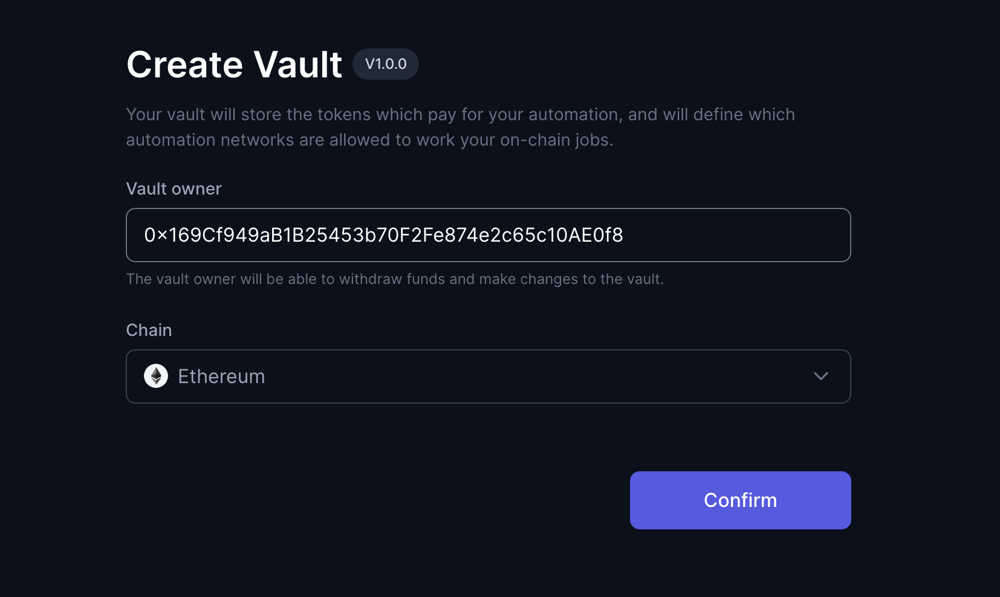
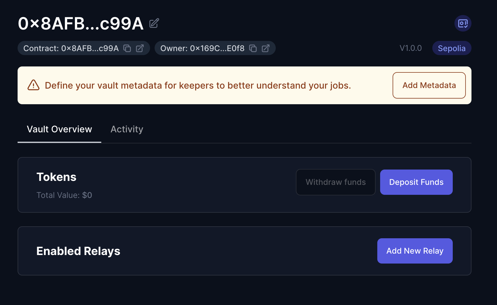
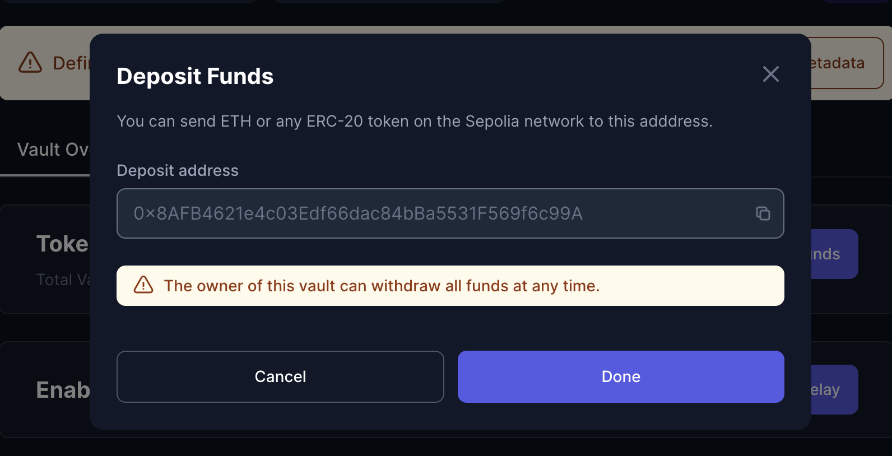
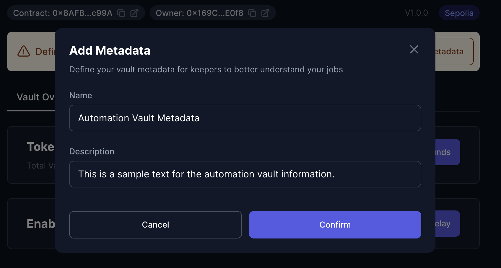
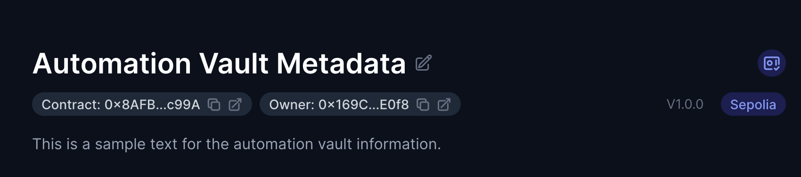

## Tutorial: Deployment and Configuration of Automation Vault

This guide provide all information needed to deploy and configure an `AutomationVault`. You can do it easily using [xkeeper.network](https://xkeeper.network/).

### Step 1: Deployment of the Automation Vault

**Create a new Automation Vault:**

- On the main page there will be a button once we connect our wallet which will allow us to create a new Automation Vault.

- Once we have clicked on it, we will see several fields.

  The first one will be the address which will be the owner of the automation vault.

  The last one is the chain in which we want to start using xkeeper.

- By default it will take the owner, the connected address and the ethereum mainnet.

- When the new automation vault is created, it will appear in the "my vaults" list. If we explore the vault we will get this:

- We have several options related to the balance for payments, relays for executions and additional metadata information. All will be explored in separate sections.

### Step 2: Adding Balance to the Automation Vault

**Transfer Funds to the Vault:**

- Transfer the necessary funds to the automation vault to cover the costs associated with task execution. This could include Native token as ETH in Ethereum network or ERC-20 tokens, depending on the protocol requirements.

### Step 3: Approval of Callers and Relays for a specific relay

**Add relay:**

- Use functions in the automation vault to approve specific relay. This might include relays such as `Keep3rRelay`, `Keep3rBondedRelay`, `GelatoRelay`, or `OpenRelay`, depending on the protocol's needs. These configurations will be explained in more detail in their specific section.

### Step 4: Adding Metadata

**Adding Metadata:**

- Adding metadata will give additional information to the various bots that will want to run the jobs in your vault. Within this option we can add a name to the vault and the relevant information for the executions in this vault.

After set the metadata, the website will display the proper information.

### Step 5: Tracking and Monitoring

**Tracking and Monitoring:**

- Monitor task executions through emitted events and other relevant metrics.

With these steps, you should have a solid guide for a protocol to deploy its automation vault, configure necessary permissions and relays, add balance, and execute automated tasks.
