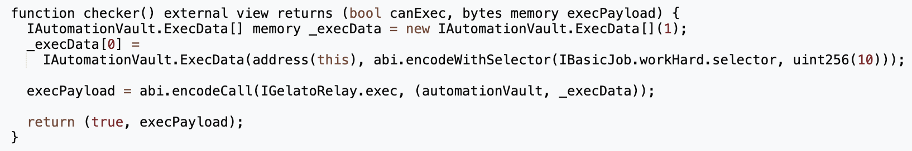
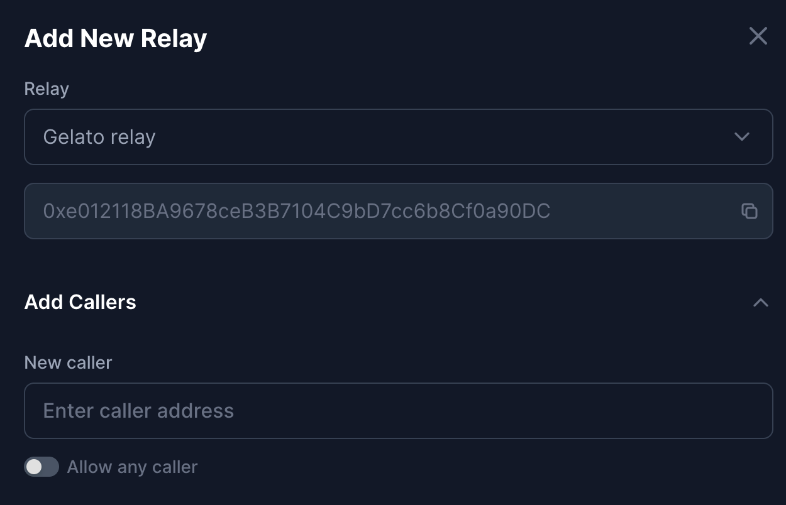
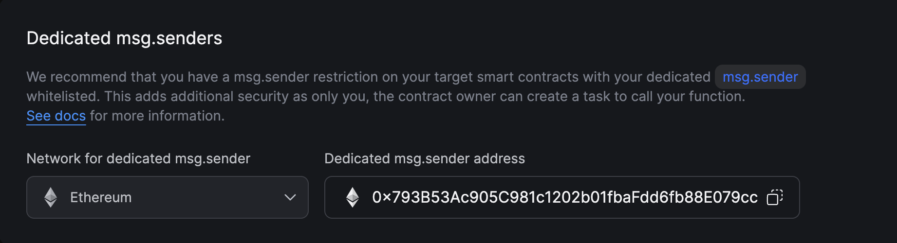
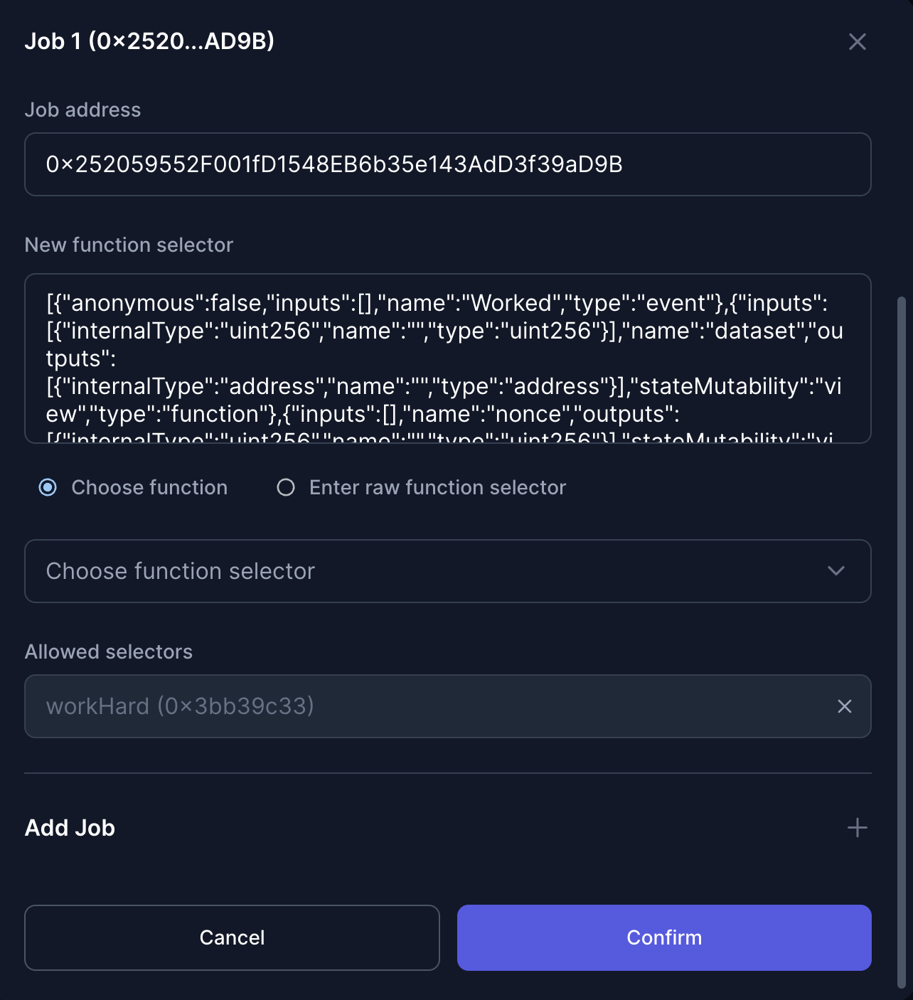
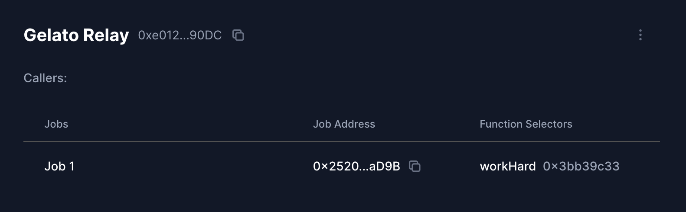

## Tutorial: Automate with Open Relay

This guide provide all information needed to configure an `Gelato Relay` for your automation vault. You can do it easily using [xkeeper.network](https://xkeeper.network/).

### Step 1: Deployment of the Automation Vault

**Automation Vault**

- If you already have an automation vault, you can skip this step, if not, deploy and configure the automation vault. You can follow the [automation vault guide](./automation_vault_guide.md).

### Step 2: Setup Keep3r Requirements

- In order to use gelato relay we will need to create a task. To do this we can use [Gelato Network](https://app.gelato.network//).In the creation of the task we have several parameters that we can configure according to the need of our job. However there are certain parameters that are necessary for the implementation of Gelato with xKeeper.

- The job needs a checker function which will have to pass the parameters for execution. Gelato has several tutorials and examples that explain this in more detail. Here is a simple example that serves as a template.

- The target contract should be the Gelato Relay.

- In the task configuration we will have to select the Transaction pays for itself option (remember that the automationVault needs balance).

### Step 3: Configure Gelato Relay

- First, in the drop down menu select the keep3r relay. The address should appear automatically since these are the relays provided by xKeeper.

- In this case, the caller to approve will be the one provided by Gelato. In Gelato's dashboard, in settings, we will get our dedicated msg.sender.

- After this, in the next tab we will display jobs. Here we will put the address of the desired job and it will automatically load the selectors to choose which function we want to be worked.

- Finally, after having added the caller and the desired jobs we will get something like this in our automation vault.

