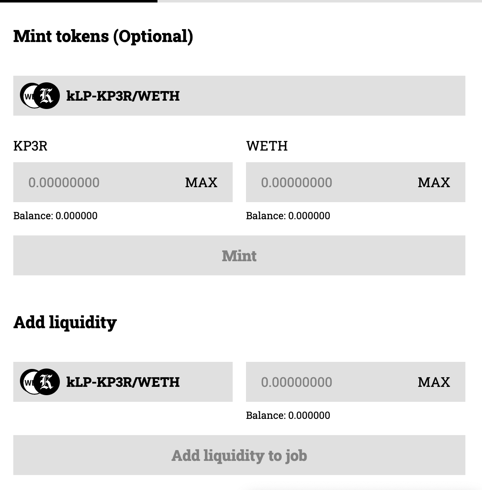
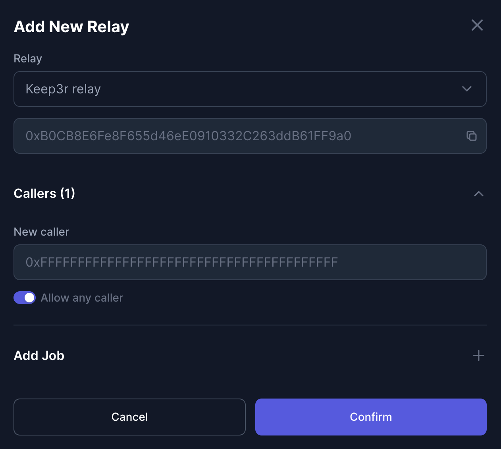
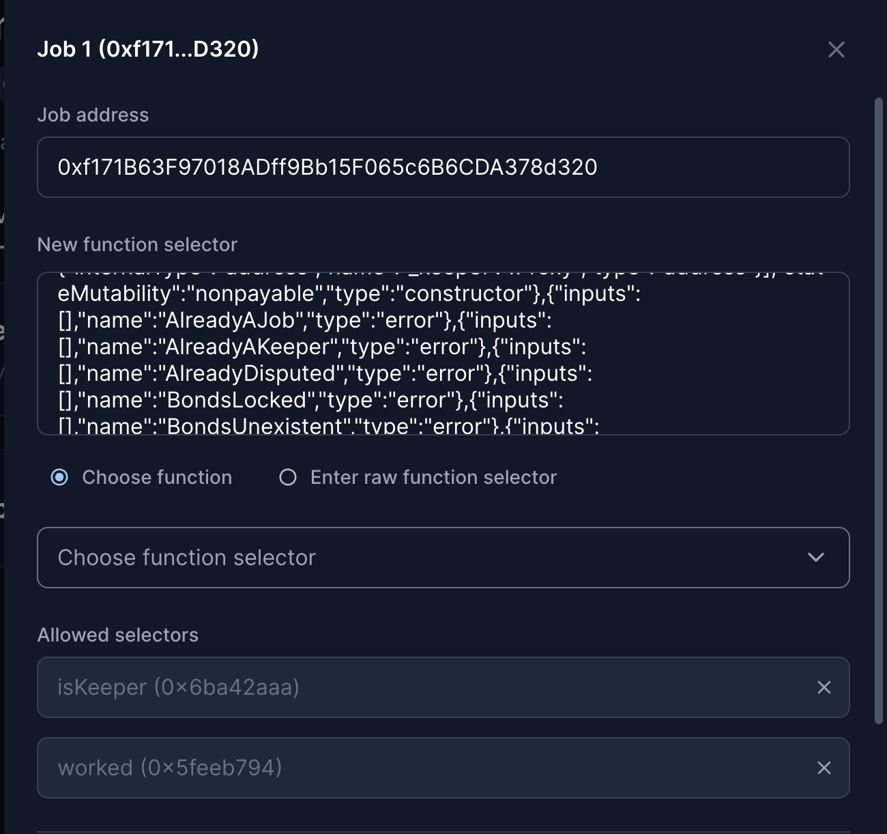
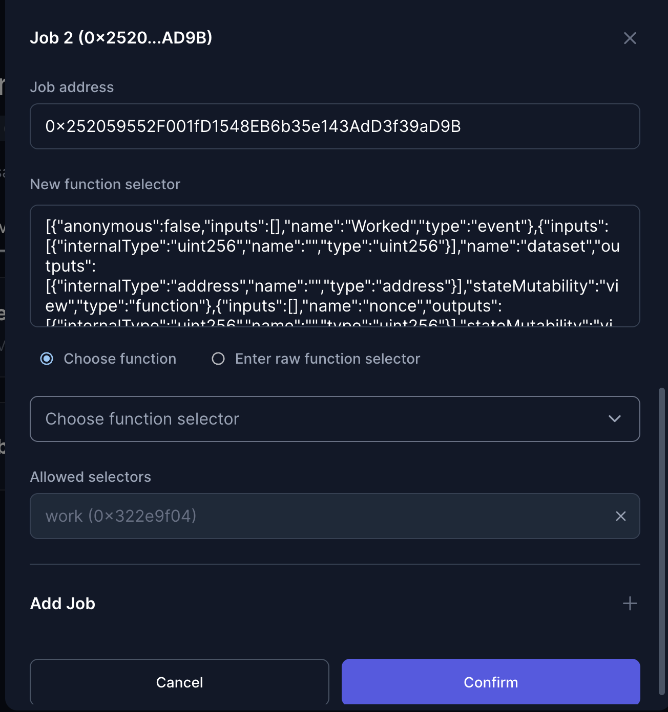
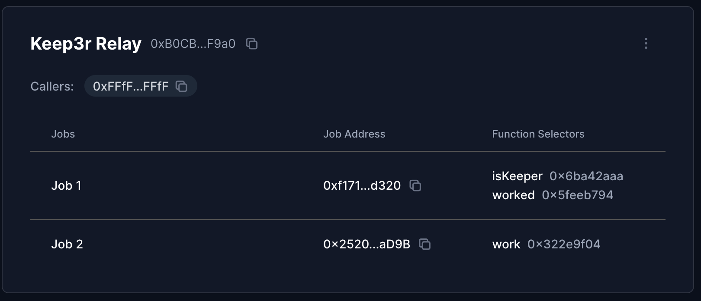

## Tutorial: Automate with Open Relay

This guide provide all information needed to configure an `Open Relay` for your automation vault. You can do it easily using [xkeeper.network](https://xkeeper.network/).

### Step 1: Deployment of the Automation Vault

**Automation Vault**

- If you already have an automation vault, you can skip this step, if not, deploy and configure the automation vault. You can follow the [automation vault guide](./automation_vault_guide.md).

### Step 2: Setup Keep3r Requirements

- First of all we will have to register our job in keep3r network, for this we will use [keep3r.network](https://https://keep3r.network//).

- Once we have registered it, our job will appear in the list. We will select it and different metrics and options will appear. Then, we will have to mint kLP. For this we need both Keep3r and Weth. Finally, we will add liquidity to that job and it will be the payment that the bots that run through our relay will receive. We will already have everything set up in relation to Keep3r.

### Step 3: Configure Keep3r Relay

- First, in the drop down menu select the keep3r relay. The address should appear automatically since these are the relays provided by xKeeper. Then we will have to approve the callers who will be able to execute the jobs. In this case, and being the keep3r relay, you can select the option that allows anyone to run our jobs.

- Now, for keep3r to work we need to add two keep3r V2 selectors. The address will vary depending on the chain we are using.

- After this, in the next tab we will display jobs. Here we will put the address of the desired job and it will automatically load the selectors to choose which function we want to be worked.

- Finally, after having added the caller and the desired jobs we will get something like this in our automation vault.

