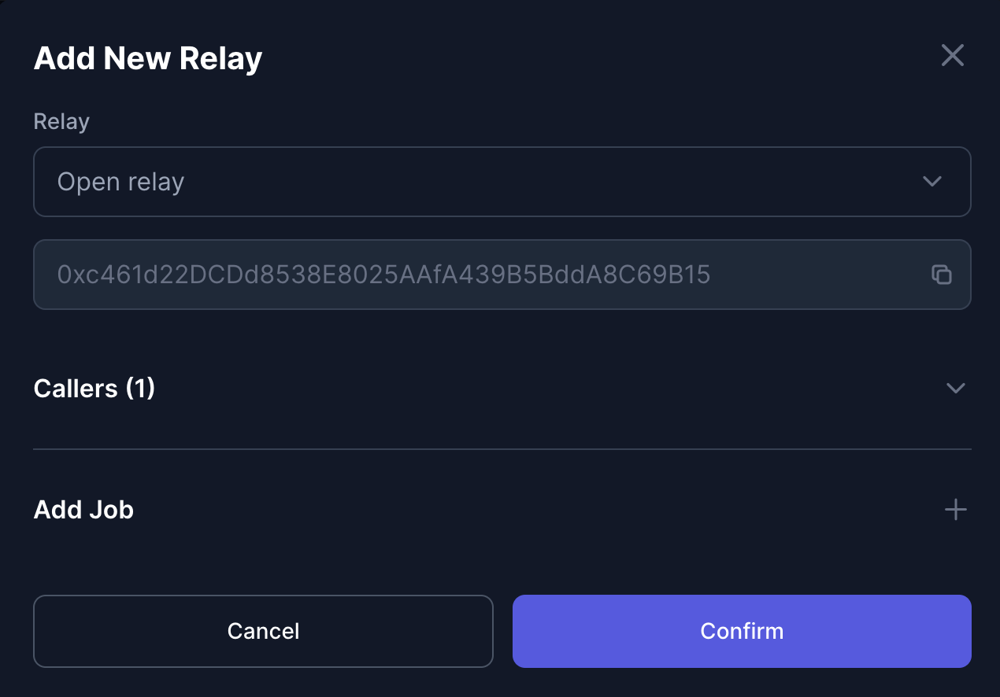
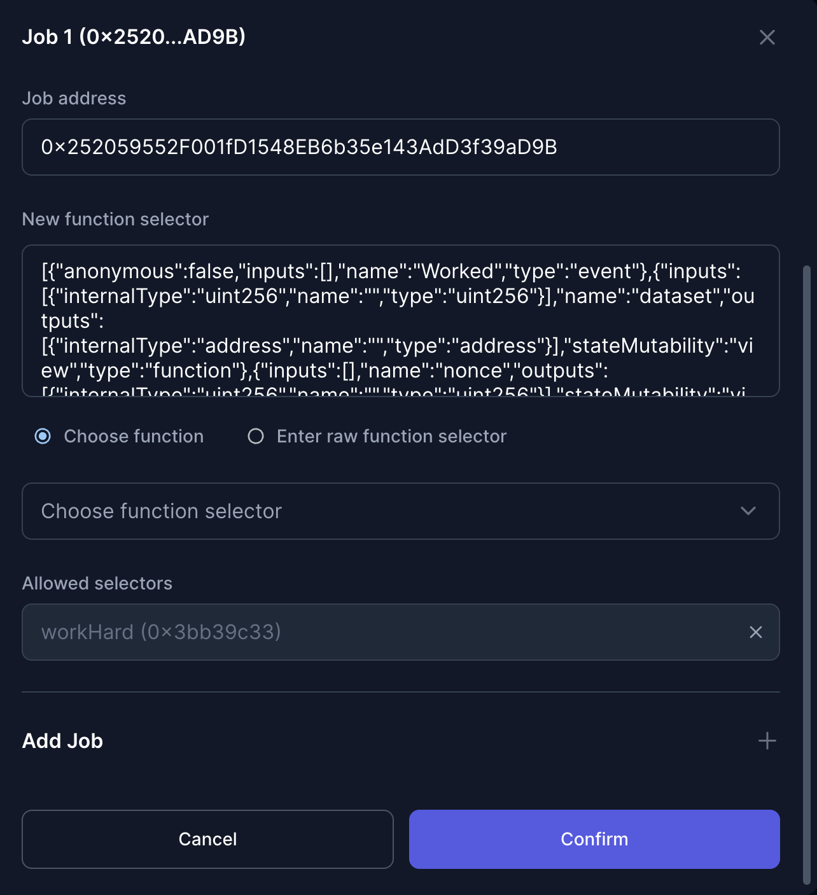
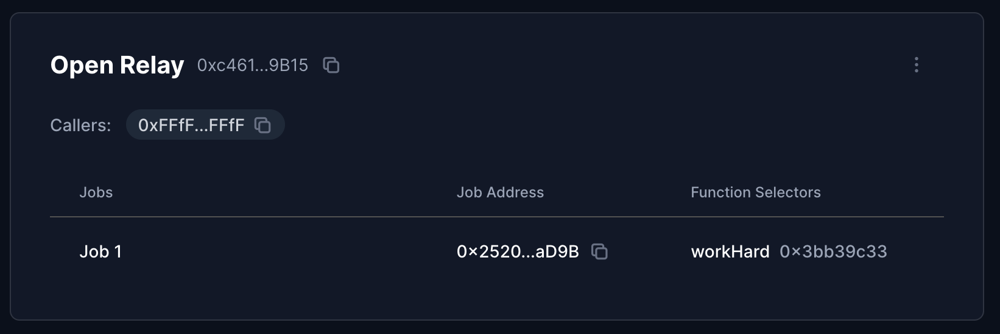

## Tutorial: Automate with Open Relay

This guide provide all information needed to configure an `Open Relay` for your automation vault. You can do it easily using [xkeeper.network](https://xkeeper.network/).

### Step 1: Deployment of the Automation Vault

**Automation Vault**

- If you already have an automation vault, you can skip this step, if not, deploy and configure the automation vault. You can follow the [automation vault guide](./automation_vault_guide.md). In this case, when using the open relay it is important that our automation vault has balance. It will be necessary in the native token of the selected chain, since it is the payment method used by this relay.

### Step 2: Configure Open Relay

- First, in the drop down menu select the open relay. The address should appear automatically since these are the relays provided by xKeeper. Then we will have to approve the callers who will be able to execute the jobs. In this case, and being the open relay, you can select the option that allows anyone to run our jobs.

- After this, in the next tab we will display jobs. Here we will put the address of the desired job and it will automatically load the selectors to choose which function we want to be worked.

- Finally, after having added the caller and the desired jobs we will get something like this in our automation vault.

